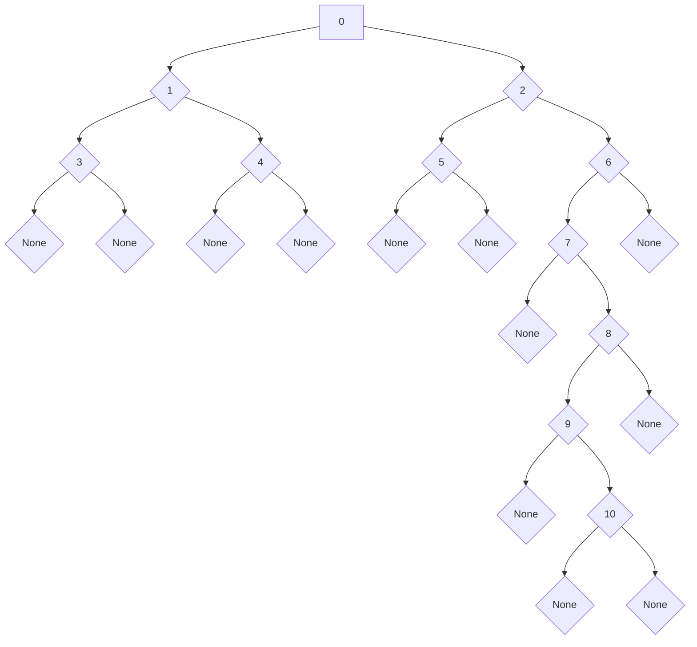

# tree_iterators_rs

If you enjoy using this crate, please star the
[github repo](https://github.com/mr-adult/tree-iterators-rs).

tree_iterators_rs is a library built to provide you with the utilities
(iterators) to easily work with tree data structures in Rust. It provides a
default implementation for the majority use cases. These include:

1. TreeNode<T> - This struct has a Vec-based list of children.
   [documentation](https://docs.rs/tree_iterators_rs/latest/tree_iterators_rs/prelude/struct.TreeNode.html)
2. BinaryTreeNode<T> - This struct contains an optional boxed reference to a
   left and right node.
   [documentation](https://docs.rs/tree_iterators_rs/latest/tree_iterators_rs/prelude/struct.BinaryTreeNode.html)

This crate is written such that you can build your own implementations as well
using other collection types. The collection type simply need to implement the
Iterator trait.

### Feature Flags

This crate only contains one feature flag:

- "serde" - this flag can be used to implement Serialize and Deserialize for
  TreeNode<T> and BinaryTreeNode<T>.

### Benefits

This crate uses no unsafe code!

The largest benefit of using this library is that the various tree iterators are
interchangeable in the for and while loop syntax. This means you can write your
code to use a breadth-first-search today and trivially swap it out for a
depth-first pre or postorder search tomorrow without significantly changing the
structure of your code. Syntactically, this library is also able to hide a lot
of complexity and provide a friendly interface.

The other benefit of this library is its tight integration with the rest of
Rust's iterators. Because each API returns an iterator, you can proceed to use
the iterator APIs like filter, map, and reduce on your trees which can very
powerfully simplify code.

## Getting Started

The easiest way to get started is to simply add this crate as a dependency and
add a using statement to pull in its prelude
(`use tree_iterators_rs::prelude::*;`). You can then create your data structure
using the BinaryTreeNode or TreeNode structs provided and use their iterator
implementations. These structs provide default implementations of all
functionality available in this crate. The methods that come attached to these
structs include the following (all of which have open source code that can be
found in
[this file](https://github.com/mr-adult/tree-iterators-rs/blob/main/src/prelude.rs)):

- Owned Iterator APIs - these take ownership of the TreeNode similarly to an
  into_iter() call.
  - [bfs()](https://docs.rs/tree_iterators_rs/latest/tree_iterators_rs/prelude/trait.OwnedTreeNode.html#method.bfs)
  - [dfs_preorder()](https://docs.rs/tree_iterators_rs/latest/tree_iterators_rs/prelude/trait.OwnedTreeNode.html#method.dfs_preorder)
  - [dfs_postorder()](https://docs.rs/tree_iterators_rs/latest/tree_iterators_rs/prelude/trait.OwnedTreeNode.html#method.dfs_postorder)
  - [dfs_inorder()](https://docs.rs/tree_iterators_rs/latest/tree_iterators_rs/prelude/trait.OwnedBinaryTreeNode.html#method.dfs_inorder) -
    this iterator is only available on BinaryTreeNode
- Mutable borrow APIs - these do not take ownership and behave similarly to an
  iter_mut() call.
  - [bfs_iter_mut()](https://docs.rs/tree_iterators_rs/latest/tree_iterators_rs/prelude/trait.MutBorrowedTreeNode.html#method.bfs_iter_mut)
  - [dfs_preorder_iter_mut()](https://docs.rs/tree_iterators_rs/latest/tree_iterators_rs/prelude/trait.MutBorrowedTreeNode.html#method.dfs_preorder_iter_mut)
  - [dfs_postorder_iter_mut()](https://docs.rs/tree_iterators_rs/latest/tree_iterators_rs/prelude/trait.MutBorrowedTreeNode.html#method.dfs_postorder_iter_mut)
  - [dfs_inorder_iter_mut](https://docs.rs/tree_iterators_rs/latest/tree_iterators_rs/prelude/trait.MutBorrowedBinaryTreeNode.html#method.dfs_inorder_iter_mut) -
    this iterator is only available on BinaryTreeNode
- Borrow APIs - these do not take ownership and behave similarly to an iter()
  call.
  - [bfs_iter()](https://docs.rs/tree_iterators_rs/latest/tree_iterators_rs/prelude/trait.BorrowedTreeNode.html#method.bfs_iter)
  - [dfs_preorder_iter()](https://docs.rs/tree_iterators_rs/latest/tree_iterators_rs/prelude/trait.BorrowedTreeNode.html#method.dfs_preorder_iter)
  - [dfs_postorder_iter()](https://docs.rs/tree_iterators_rs/latest/tree_iterators_rs/prelude/trait.BorrowedTreeNode.html#method.dfs_postorder_iter)
  - [dfs_inorder_iter()](https://docs.rs/tree_iterators_rs/latest/tree_iterators_rs/prelude/trait.BorrowedBinaryTreeNode.html#method.dfs_inorder_iter) -
    this iterator is only available on BinaryTreeNode
- In addition, all of these APIs have additional
  [modifier methods](https://docs.rs/tree_iterators_rs/latest/tree_iterators_rs/prelude/trait.TreeIterator.html)
  which include .leaves() and attach_ancestors(). Each of these can be chained
  after the iterator call (more details in **Examples**).

## Change Log

2.0.0 - This version removes the Option wrapping of children iterators. This
wrapping is redundant since iterators can represent empty collections in and of
themselves. Removing it will improve performance going forward. All iterator
methods (bfs(), dfs_preorder(), dfs_postorder(), etc.) can be used just the same
as in previous versions.

## Examples

For all of the following examples, we will use the tree structure as follows. It
is complicated enough to convey the tree iterators' behavior thoroughly without
being overwhelming. Code to build this tree using both the BinaryTreeNode and
TreeNode structs is provided below.



Using BinaryTreeNode

```rust
use tree_iterators_rs::prelude::*;

pub fn create_example_binary_tree() -> BinaryTreeNode<usize> {
    BinaryTreeNode {
        value: 0,
        left: Some(Box::new(BinaryTreeNode {
            value: 1,
            left: Some(Box::new(BinaryTreeNode {
                value: 3,
                left: None,
                right: None,
            })),
            right: Some(Box::new(BinaryTreeNode {
                value: 4,
                left: None,
                right: None,
            })),
        })),
        right: Some(Box::new(BinaryTreeNode {
            value: 2,
            left: Some(Box::new(BinaryTreeNode {
                value: 5,
                left: None,
                right: None,
            })),
            right: Some(Box::new(BinaryTreeNode {
                value: 6,
                left: Some(Box::new(BinaryTreeNode {
                    value: 7,
                    left: None,
                    right: Some(Box::new(BinaryTreeNode {
                        value: 8,
                        left: Some(Box::new(BinaryTreeNode {
                            value: 9,
                            left: None,
                            right: Some(Box::new(BinaryTreeNode {
                                value: 10,
                                left: None,
                                right: None,
                            })),
                        })),
                        right: None,
                    })),
                })),
                right: None,
            })),
        })),
    }
}
```

Using TreeNode

```rust
use tree_iterators_rs::prelude::*;

pub fn create_example_tree() -> TreeNode<usize> {
	use std::vec::Vec;

    TreeNode {
        value: 0,
        children: vec![
            TreeNode {
                value: 1,
                children: vec![
                    TreeNode {
                        value: 3,
                        children: Vec::with_capacity(0),
                    },
                    TreeNode {
                        value: 4,
                        children: Vec::with_capacity(0),
                    },
                ],
            },
            TreeNode {
                value: 2,
                children: vec![
                    TreeNode {
                        value: 5,
                        children: Vec::with_capacity(0),
                    },
                    TreeNode {
                        value: 6,
                        children: vec![TreeNode {
                            value: 7,
                            children: vec![TreeNode {
                                value: 8,
                                children: vec![TreeNode {
                                    value: 9,
                                    children: vec![TreeNode {
                                        value: 10,
                                        children: Vec::with_capacity(0),
                                    }],
                                }],
                            }],
                        }],
                    },
                ],
            },
        ],
    }
}
```

### Breadth-First-Search (BFS)

All 3 APIs' usages are identical other than their borrowing model, so only one
example will be given. Say we want to join all of the values in our test tree
into a string. We can do this as follows:

```rust
use tree_iterators_rs::{
	examples::create_example_tree,
	prelude::*
};

// Tree creation (see above documentation)
let root = create_example_tree();

let mut result = String::new();
for value in root.bfs() {
	result.push_str(&value.to_string());
	result.push_str(", ");
}

// result: 0, 1, 2, 3, 4, 5, 6, 7, 8, 9, 10,
println!("{}", result);
```

This code could also be written using Rust's iterator APIs:

```rust
use tree_iterators_rs::{
	examples::create_example_tree,
	prelude::*
};

// Tree creation (see above documentation)
let root = create_example_tree();

let result = 
	root.bfs()
		.map(|val| val.to_string())
		.collect::<Vec<String>>()
		.join(", ");

// result: 0, 1, 2, 3, 4, 5, 6, 7, 8, 9, 10
println!("{}", result);
```

An equivalent set of code not using this crate would look like this:

```rust
use tree_iterators_rs::examples::create_example_tree;
use std::collections::VecDeque;

// Tree creation (see above documentation)
let root = create_example_tree();

let mut result = String::new();

let mut queue = VecDeque::new();
queue.push_back(root);
while queue.len() > 0 {
	if let Some(front) = queue.pop_front() {
		for child in front.children {
			queue.push_back(child);
		}

		result.push_str(&front.value.to_string());
		result.push_str(", ");
	}
}

// result: 0, 1, 2, 3, 4, 5, 6, 7, 8, 9, 10,
println!("{}", result);
```

### Depth-First Preorder Search (DFS Preorder)

Similarly to the BFS example, all 3 APIs' usages are identical other than their
borrowing model, so only one example will be given. Say we want to join all of
the values in our test tree into a string. We can do this as follows:

```rust
use tree_iterators_rs::{
	examples::create_example_tree,
	prelude::*
};

// Tree creation (see above documentation)
let root = create_example_tree();

let mut result = String::new();
for value in root.dfs_preorder() {
	result.push_str(&value.to_string());
	result.push_str(", ");
}

// result: 0, 1, 3, 4, 2, 5, 6, 7, 8, 9, 10,
println!("{}", result);
```

This code could also be written using Rust's iterator APIs:

```rust
use tree_iterators_rs::{
	examples::create_example_tree,
	prelude::*
};

// Tree creation (see above documentation)
let root = create_example_tree();

let result = 
	root.dfs_preorder()
		.map(|val| val.to_string())
		.collect::<Vec<String>>()
		.join(", ");

// result: 0, 1, 3, 4, 2, 5, 6, 7, 8, 9, 10
println!("{}", result);
```

An equivalent set of code not using this crate would look like this:

```rust
use tree_iterators_rs::examples::create_example_tree;

// Tree creation (see above documentation)
let root = create_example_tree();

let mut result = String::new();

let mut stack = vec![root];
while stack.len() > 0 {
	if let Some(mut top) = stack.pop() {
		top.children.reverse();
		for child in top.children {
			stack.push(child);
		}

		result.push_str(&top.value.to_string());
		result.push_str(", ");
	}
}

// result: 0, 1, 3, 4, 2, 5, 6, 7, 8, 9, 10,
println!("{}", result);
```

### Binary Trees Only - Depth First In Order Search (DFS In Order)

Similarly to the other examples, all 3 APIs' usages are identical other than
their borrowing model, so only one example will be given. Say we want to join
all of the values in our test tree into a string. We can do this as follows:

```rust
use tree_iterators_rs::{
	examples::create_example_binary_tree,
	prelude::*
};

// Tree creation (see above documentation)
let root = create_example_binary_tree();

let mut result = String::new();
for value in root.dfs_inorder() {
	result.push_str(&value.to_string());
	result.push_str(", ");
}

// result: 3, 1, 4, 0, 5, 2, 7, 9, 10, 8, 6,
println!("{}", result);
```

This code could also be written using Rust's iterator APIs:

```rust
use tree_iterators_rs::{
	examples::create_example_binary_tree,
	prelude::*
};

// Tree creation (see above documentation)
let root = create_example_binary_tree();

let result = root.dfs_preorder()
	.map(|val| val.to_string())
	.collect::<Vec<String>>()
	.join(", ");

// result: 3, 1, 4, 0, 5, 2, 7, 9, 10, 8, 6
println!("{}", result);
```

An equivalent set of code not using this crate would look like the following. It
is important to note that the dfs_inorder API does not use recursion and thus
does not incur the overhead of stack frames that this example does. For purposes
of simplicity in the example, recursion was chosen. Rust's ownership model is
difficult to work around with this traversal type and would make the example
more complex than necessary.

```rust
use tree_iterators_rs::{
	examples::create_example_binary_tree,
	prelude::*
};

fn dfs_inorder(node: Option<Box<BinaryTreeNode<usize>>>, result: &mut String) {
	match node {
		None => {}
		Some(node) => {
			dfs_inorder(node.left, result);
			result.push_str(&node.value.to_string());
			result.push_str(", ");
			dfs_inorder(node.right, result)
		}
	}            
}

// Tree creation (see above documentation)
let root = create_example_binary_tree();

let mut result = String::new();
dfs_inorder(Some(Box::new(root)), &mut result);

// result: 3, 1, 4, 0, 5, 2, 7, 9, 10, 8, 6,
println!("{}", result);
```

### Depth First Postorder Search (DFS Postorder)

Similarly to the BFS and other DFS examples, all 3 APIs' usages are identical
other than their borrowing model, so only one example will be given. Say we want
to join all of the values in our test tree into a string. We can do this as
follows:

```rust
use tree_iterators_rs::{
	examples::create_example_tree,
	prelude::*
};

// Tree creation (see above documentation)
let root = create_example_tree();

let mut result = String::new();
for value in root.dfs_postorder() {
	result.push_str(&value.to_string());
	result.push_str(", ");
}

// result: 3, 4, 1, 5, 10, 9, 8, 7, 6, 2, 0,
println!("{}", result);
```

This code could also be written using Rust's iterator APIs:

```rust
use tree_iterators_rs::{
	examples::create_example_tree,
	prelude::*
};

// Tree creation (see above documentation)
let root = create_example_tree();

let result = 
	root.dfs_postorder()
		.map(|val| val.to_string())
		.collect::<Vec<String>>()
		.join(", ");

// result: 3, 4, 1, 5, 10, 9, 8, 7, 6, 2, 0
println!("{}", result);
```

An equivalent set of code not using this crate would look like the following. It
is important to note that the dfs_postorder API does not use recursion and thus
does not incur the overhead of stack frames that this example does. For purposes
of simplicity in the example, recursion was chosen. Rust's ownership model is
difficult to work around with this traversal type and would make the example
more complex than necessary.

```rust
use tree_iterators_rs::{
	examples::create_example_tree,
	prelude::*
};

fn dfs_postorder(node: TreeNode<usize>, result: &mut String) {
	for child in node.children {
		dfs_postorder(child, result);
	}

	result.push_str(", ");
	result.push_str(&node.value.to_string());
}

// Tree creation (see above documentation)
let root = create_example_tree();

let mut result = String::new();
dfs_postorder(root, &mut result);

// result: 3, 4, 1, 5, 10, 9, 8, 7, 6, 2, 0,
println!("{}", result);
```

## Iterator Modifiers

### Attach Context

`attach_context()` is a method that can be chained after any of the above APIs
(when called on a TreeNode) or any other type that implements one of the
*TreeNode traits. This API converts the iterator structure into one that returns
the entire context of the current node in the tree. This includes:

1. the entire stack of values back up to the root node
2. the current node's children collection
3. the index path to the current node.

This information is incredibly useful and can be used to do thing like check if
any subtrees contain certain information. In the following example, we are
scanning each subtree to see if it contains a node with a value of '10'.

NOTE: Be sure to add a use statement for streaming_iterator::StreamingIterator
to pull in the filter, map, reduce, for_each, etc. methods from the
streaming_iterator crate.

```rust
use tree_iterators_rs::examples::create_example_tree;
use tree_iterators_rs::prelude::*;
use streaming_iterator::StreamingIterator;

let root = create_example_tree();

let mut subtree_contains_10;
let mut iter = root.dfs_preorder().attach_context();
while let Some(node_context) = iter.next() {
    subtree_contains_10 = node_context
        .children()
        .iter()
        .flat_map(|child| child.dfs_preorder_iter())
        .any(|descendent| *descendent == 10);

    println!("{:?} {}", node_context.ancestors(), subtree_contains_10);
}

// Results:
// [0] true
// [0, 1] false
// [0, 1, 3] false
// [0, 1, 4] false
// [0, 2] true
// [0, 2, 5] false
// [0, 2, 6] true
// [0, 2, 6, 7] true
// [0, 2, 6, 7, 8] true
// [0, 2, 6, 7, 8, 9] true
// [0, 2, 6, 7, 8, 9, 10] false
```

### Attach Ancestors

`attach_ancestors()` is a method that can be called after any of the above APIs
to change the iterator structure into one that returns a slice of all ancestors
and the current value in the tree. If one of these is called, the (now
streaming) iterator will yield a slice where the item at index 0 is the root
value, the item at index len() - 1 is the current value, and everything in
between is the other ancestors. As an example, when we are at the value of 10 in
our traversal (see above documentation), the slice will look like this: \[0, 2,
6, 7, 8, 9, 10\].

For example, we can use this API to filter down to only the values where all of
the ancestors and the current node are even numbers in the example tree.

NOTE: Be sure to add a use statement for streaming_iterator::StreamingIterator
to pull in the filter, map, reduce, for_each, etc. methods from the
streaming_iterator crate.

```rust
use streaming_iterator::StreamingIterator;
use tree_iterators_rs::{
	examples::create_example_binary_tree,
	prelude::*
};

let root = create_example_binary_tree();
let mut result = String::new();

root.dfs_inorder_iter()
	.attach_ancestors()
	.filter(|slice| 
		slice.iter().all(|value| **value % 2 == 0)
	)
	.map(|slice| slice[slice.len() - 1])
	.for_each(|value| {
		result.push(' ');
		result.push_str(&value.to_string())
	});

// result: 0 2 6
println!("{}", result);
```

We can do the same with the postorder iterator to get the result in reverse:

```rust
use streaming_iterator::StreamingIterator;
use tree_iterators_rs::{
	examples::create_example_tree,
	prelude::*
};

let root = create_example_tree();
let mut result = String::new();

root.dfs_postorder_iter()
	.attach_ancestors()
	.filter(|slice| 
		slice.iter().all(|value| **value % 2 == 0)
	)
	.map(|slice| slice[slice.len() - 1])
	.for_each(|value| {
		result.push(' ');
		result.push_str(&value.to_string())
	});

// result: 6 2 0
println!("{}", result);
```

And we can do the same with a breadth-first search. This just so happens to
yield the same result as the depth first preorder iterator:

```rust
use streaming_iterator::StreamingIterator;
use tree_iterators_rs::{
	examples::create_example_tree,
	prelude::*
};

let root = create_example_tree();
let mut result = String::new();

root.bfs_iter()
	.attach_ancestors()
	.filter(|slice| 
		slice.iter().all(|value| **value % 2 == 0)
	)
	.map(|slice| slice[slice.len() - 1])
	.for_each(|value| {
		result.push(' ');
		result.push_str(&value.to_string())
	});

// result: 0 2 6
println!("{}", result);
```

### Leaves

[leaves()](https://docs.rs/tree_iterators_rs/latest/tree_iterators_rs/prelude/trait.TreeIterator.html#method.leaves)
is a method that can be called after any of the above APIs (including
attach_ancestors() - see
[here](https://docs.rs/tree_iterators_rs/latest/tree_iterators_rs/prelude/trait.AncestorsIterator.html#method.leaves))
to change the iterator structure to one that only returns leaves of the tree. In
the example tree (see above documentation), this will always result in the
sequence 3, 4, 5, 10. Once this method is called, the iterator transforms to be
either a breadth-first (if the iterator was previously breadth-first) or a depth
first postorder search (if the iterator was previously one of pre-, in-, or
post-order depth first searches).

I will be using the depth first preorder search in the examples, but this works
with all of the traversal types. This method can be called immediately if you
wish to only receive the leaves of the tree like so:

```rust
use tree_iterators_rs::{
	examples::create_example_tree,
	prelude::*
};

let root = create_example_tree();

let result = root.dfs_preorder()
	.leaves()
	.map(|val| val.to_string())
	.collect::<Vec<String>>()
	.join(", ");

// result: 3, 4, 5, 10
println!("{}", result);
```

Alternatively, this method can be used to perform a normal traversal and then
switch to a leaves-only traversal partway through the regular one. This can be
done like so (again, all traversal types support this):

```rust
use tree_iterators_rs::{
	examples::create_example_tree,
	prelude::*
};

let root = create_example_tree();

let mut dfs_preorder = root.dfs_preorder();

let mut results = Vec::new();
// take the first 2 non-leaves before switching to a leaves-only iterator
results.push(dfs_preorder.next().unwrap().to_string());
results.push(dfs_preorder.next().unwrap().to_string());

// once leaves is called, iteration switches to a depth-first postorder search
for leaf in dfs_preorder.leaves() {
	results.push(leaf.to_string());
}

let result = results.join(", ");

// result: 0, 1, 3, 4, 5, 10,
println!("{}", result);
```

## Custom Tree Node Implementations

This crates' APIs are powered by 3 traits. The traits include:

1. [OwnedTreeNode](https://docs.rs/tree_iterators_rs/latest/tree_iterators_rs/prelude/trait.OwnedTreeNode.html)/[OwnedBinaryTreeNode](https://docs.rs/tree_iterators_rs/latest/tree_iterators_rs/prelude/trait.OwnedBinaryTreeNode.html) -
   these traits powers the bfs(), dfs_preorder(), dfs_inorder() and
   dfs_postorder() APIs.
2. [MutBorrowedTreeNode](https://docs.rs/tree_iterators_rs/latest/tree_iterators_rs/prelude/trait.MutBorrowedTreeNode.html)/[MutBorrowedBinaryTreeNode](https://docs.rs/tree_iterators_rs/latest/tree_iterators_rs/prelude/trait.MutBorrowedBinaryTreeNode.html) -
   these traits powers the bfs_iter_mut(), dfs_preorder_iter_mut(),
   dfs_inorder_iter_mut and dfs_postorder() APIs.
3. [BorrowedTreeNode](https://docs.rs/tree_iterators_rs/latest/tree_iterators_rs/prelude/trait.BorrowedTreeNode.html)/[BorrowedBinaryTreeNode](https://docs.rs/tree_iterators_rs/latest/tree_iterators_rs/prelude/trait.BorrowedBinaryTreeNode.html) -
   these traits powers the bfs_iter(), dfs_preorder_iter(), dfs_inorder_iter()
   and dfs_postorder_iter() APIs.

You may pick and choose which of the traits you implement to suit your needs.
They are identical apart from some naming conventions and the ownership of the
value returned from their required method implementation.

### Example

As an example, we can implement another TreeNode variant that uses a Linked List
to hold its children. All code here is MIT licensed and you are free to directly
copy or modify it as you see fit subject to the conditions of the license.

```rust
use tree_iterators_rs::prelude::*;
use std::collections::LinkedList;

struct LLTreeNode<T> {
    value: T,
    children: LinkedList<LLTreeNode<T>>
}
```

This is a good start, but realistically we want it to implement all of the tree
traversal APIs available to us.

#### Owned implementation

We can start with the OwnedTreeNode implementation as follows.

```rust
use tree_iterators_rs::prelude::*;
use std::collections::LinkedList;

struct LLTreeNode<T> {
    value: T,
    children: LinkedList<LLTreeNode<T>>
}

impl<T> OwnedTreeNode for LLTreeNode<T> {
    type OwnedValue = T;
    type OwnedChildren = LinkedList<LLTreeNode<T>>;

    fn get_value_and_children(self) -> (Self::OwnedValue, Self::OwnedChildren) {
        (
            self.value,
            self.children
        )
    }
}
```

Now that we have implemented OwnedTreeNode, our type has the bfs(),
dfs_preorder(), and dfs_postorder() methods.

#### Mutable Borrow Implementation

The mutable borrow implementation is very similar to the owned one. The only
difference is that the 'Value' and 'Children' associated types changed to
mutable references and we are returning an mutable reference to the children
LinkedList instead of an owned LinkedList.

```rust
use tree_iterators_rs::prelude::*;
use std::collections::LinkedList;

struct LLTreeNode<T> {
    value: T,
    children: LinkedList<LLTreeNode<T>>
}

impl<'a, T> MutBorrowedTreeNode<'a> for LLTreeNode<T> 
    where Self: 'a {

    type MutBorrowedValue = &'a mut T;
    type MutBorrowedChildren = &'a mut LinkedList<LLTreeNode<T>>;

    fn get_value_and_children_iter_mut(&'a mut self) -> (Self::MutBorrowedValue, Self::MutBorrowedChildren) {
        (
            &mut self.value,
            &mut self.children
        )
    }
}
```

Now that we have implemented MutBorrowedTreeNode, our type has the
bfs_iter_mut(), dfs_preorder_iter_mut(), and dfs_postorder_iter_mut() methods.

#### Borrow Implementation

The borrow implementation is very similar to the mutably borrowed one.

```rust
use tree_iterators_rs::prelude::*;
use std::collections::LinkedList;

struct LLTreeNode<T> {
    value: T,
    children: LinkedList<LLTreeNode<T>>
}

impl<'a, T> BorrowedTreeNode<'a> for LLTreeNode<T> 
    where Self: 'a {

    type BorrowedValue = &'a T;
    type BorrowedChildren = &'a LinkedList<LLTreeNode<T>>;

    fn get_value_and_children_iter(&'a self) -> (Self::BorrowedValue, Self::BorrowedChildren) {
        (
            &self.value,
            &self.children
        )
    }
}
```

Now that we have implemented BorrowedTreeNode, our type has the bfs_iter(),
dfs_preorder_iter(), and dfs_postorder_iter() methods.

### Exotic Use Cases

This library is purposely very loose in its trait declarations, so it opens the
door to some pretty exotic data transformations and use cases. Each iterator is
as lazy as possible and only calls the get_value_and_children method variant
once per node in the tree. This means you are able to lazily build/generate the
tree as traversal progresses if you choose to. This opens the door to using this
library to do some crazy things.
