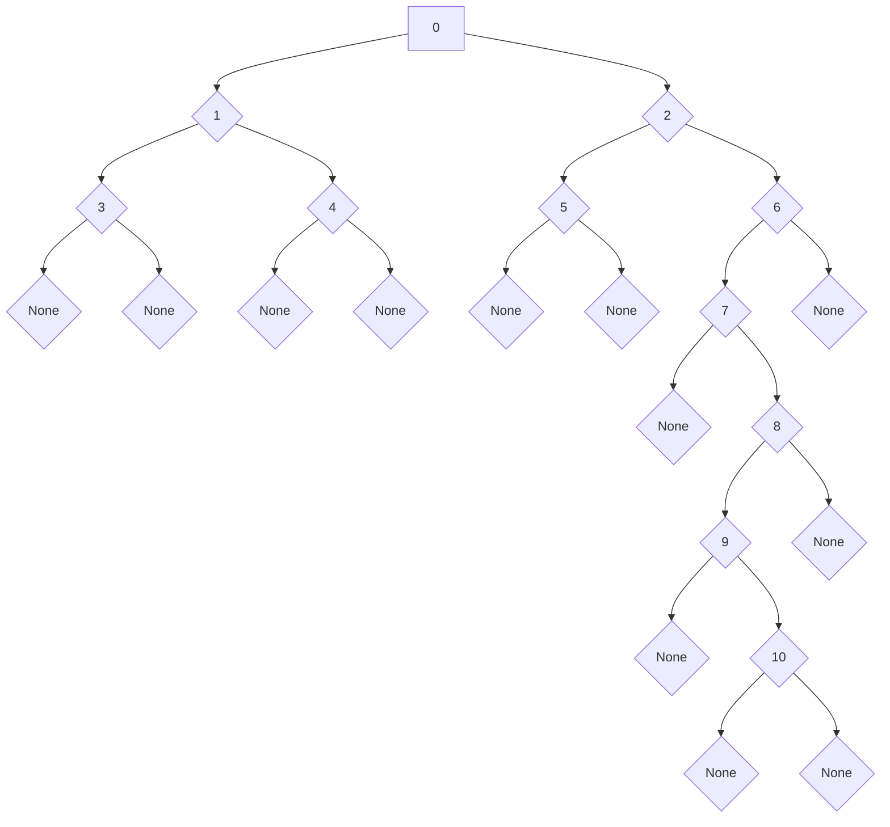

# tree_iterators_rs

If you enjoy using this crate, please star the
[github repo](https://github.com/mr-adult/tree-iterators-rs).

tree_iterators_rs is a library built to provide you with the tools to easily
work with tree data structures in Rust. It provides a default implementation for
the majority use cases. These include:

1. [`Tree<T>`](crate::prelude::Tree) - This struct has a Vec-based list of
   children.
2. [`BinaryTree<T>`](crate::prelude::BinaryTree) - This struct contains an
   optional boxed reference to a left and right node.

This crate is written such that you can build your own Tree implementations as
well using other collection types. The collection type simply need to implement
the IntoIterator trait.

### Feature Flags

This crate only contains one feature flag:

- "serde" - this flag can be used to implement Serialize and Deserialize for
  [`Tree<T>`](crate::prelude::Tree) and
  [`BinaryTree<T>`](crate::prelude::BinaryTree).

### Benefits

This library does all of the boring overhead of working with trees for you. This
includes things like:

- iterating through the nodes of the tree in the correct order (preorder vs.
  postorder vs. inorder vs. breadth first),
- tracking the ancestors of each node,
- tracking the path to each node from the root of the tree,
- managing mutable/immutable references to the nodes of the tree,
- ensuring that all operations can be done safely within Rust's borrow checker
  rules

Additionally, with its iterator-based APIs, this library allows you to trivially
swap your iteration method simply by replacing one method call (ex. `.bfs()`)
with another (ex. `.dfs_preorder()`). These methods make your intention much
clearer than hand-rolling the algorithm at every location.

Because each API returns an iterator, you can proceed to use the iterator APIs
like [`filter`](core::iter::Iterator::filter),
[`map`](core::iter::Iterator::map), and [`reduce`](core::iter::Iterator::reduce)
on each node of your trees. This can very powerfully simplify code.

## Getting Started

The easiest way to get started is to simply add this crate as a dependency and
add a using statement to pull in its prelude
(`use tree_iterators_rs::prelude::*;`). You can then create your data structure
using the BinaryTree or Tree structs provided and use their iterator
implementations. These structs provide implementations for of all functionality
available in this crate.

## Available APIs

> **_NOTE:_** If your code can be executed using any tree traversal order,
> prefer using one of the `dfs_preorder()` APIs. These are the most memory
> efficient.

| API                      | Ownership        | Tree docs                                                                                 | BinaryTree docs                                                                                 |
| ------------------------ | ---------------- | ----------------------------------------------------------------------------------------- | ----------------------------------------------------------------------------------------------- |
| bfs()                    | owned            | [`bfs()`](crate::prelude::OwnedTreeNode::bfs)                                             | [`bfs()`](crate::prelude::OwnedBinaryTreeNode::bfs)                                             |
| dfs_preorder()           | owned            | [`dfs_preorder()`](crate::prelude::OwnedTreeNode::dfs_preorder)                           | [`dfs_preorder()`](crate::prelude::OwnedBinaryTreeNode::dfs_preorder)                           |
| dfs_postorder()          | owned            | [`dfs_postorder()`](crate::prelude::OwnedTreeNode::dfs_postorder)                         | [`dfs_postorder()`](crate::prelude::OwnedBinaryTreeNode::dfs_postorder)                         |
| dfs_inorder()            | owned            | N/A                                                                                       | [`dfs_inorder()`](crate::prelude::OwnedBinaryTreeNode::dfs_inorder)                             |
| bfs_iter()               | borrowed         | [`bfs_iter()`](crate::prelude::BorrowedTreeNode::bfs_iter)                                | [`bfs_iter()`](crate::prelude::BorrowedBinaryTreeNode::bfs_iter)                                |
| dfs_preorder_iter()      | borrowed         | [`dfs_preorder_iter()`](crate::prelude::BorrowedTreeNode::dfs_preorder_iter)              | [`dfs_preorder_iter()`](crate::prelude::BorrowedBinaryTreeNode::dfs_preorder_iter)              |
| dfs_postorder_iter()     | borrowed         | [`dfs_postorder_iter()`](crate::prelude::BorrowedTreeNode::dfs_postorder_iter)            | [`dfs_postorder_iter()`](crate::prelude::BorrowedBinaryTreeNode::dfs_postorder_iter)            |
| dfs_inorder_iter()       | borrowed         | N/A                                                                                       | [`dfs_inorder_iter()`](crate::prelude::BorrowedBinaryTreeNode::dfs_inorder_iter)                |
| bfs_iter_mut()           | mutably borrowed | [`bfs_iter_mut()`](crate::prelude::MutBorrowedTreeNode::bfs_iter_mut)                     | [`bfs_iter_mut()`](crate::prelude::MutBorrowedBinaryTreeNode::bfs_iter_mut)                     |
| dfs_preorder_iter_mut()  | mutably borrowed | [`dfs_preorder_iter_mut()`](crate::prelude::MutBorrowedTreeNode::dfs_preorder_iter_mut)   | [`dfs_preorder_iter_mut()`](crate::prelude::MutBorrowedBinaryTreeNode::dfs_preorder_iter_mut)   |
| dfs_postorder_iter_mut() | mutably borrowed | [`dfs_postorder_iter_mut()`](crate::prelude::MutBorrowedTreeNode::dfs_postorder_iter_mut) | [`dfs_postorder_iter_mut()`](crate::prelude::MutBorrowedBinaryTreeNode::dfs_postorder_iter_mut) |
| dfs_inorder_iter_mut()   | mutably borrowed | N/A                                                                                       | [`dfs_inorder_iter_mut()`](crate::prelude::MutBorrowedBinaryTreeNode::dfs_inorder_iter_mut)     |

### Modifier Methods

In addition to these APIs, all of the above APIs' iterators can be transformed
into other iterators by chaining one of the following methods:

- [`.attach_context()`](#attach-context)
- [`.attach_ancestors()`](#attach-ancestors)
- [`.leaves()`](#leaves)

## Change Log

- 3.4.0
  - adds
    [`OwnedIntoIteratorOfTrees::at_path`](crate::prelude::OwnedIntoIteratorOfTrees::at_path)
  - adds
    [`OwnedIntoIteratorOfBinaryTrees::at_path`](crate::prelude::OwnedIntoIteratorOfBinaryTrees::at_path)
  - adds
    [`MutBorrowedIntoIteratorOfTrees::at_path_mut`](crate::prelude::MutBorrowedIntoIteratorOfTrees::at_path_mut)
  - adds
    [`MutBorrowedIntoIteratorOfBinaryTrees::at_path_mut`](crate::prelude::MutBorrowedIntoIteratorOfBinaryTrees::at_path_mut)
  - adds
    [`BorrowedIntoIteratorOfTrees::at_path_ref`](crate::prelude::BorrowedIntoIteratorOfTrees::at_path_ref)
  - adds
    [`BorrowedIntoIteratorOfBinaryTrees::at_path_ref`](crate::prelude::BorrowedIntoIteratorOfBinaryTrees::at_path_ref)

- 3.3.1
  - Updates documentation on
    [`TreeContext::children`](crate::prelude::TreeContext::children) and
    [`TreeContext::children_mut`](crate::prelude::TreeContext::children_mut)

- 3.3.0
  - adds [`OwnedTreeNode::at_path`](crate::prelude::OwnedTreeNode::at_path)
  - adds
    [`OwnedBinaryTreeNode::at_path`](crate::prelude::OwnedBinaryTreeNode::at_path)
  - adds
    [`MutBorrowedTreeNode::at_path_mut`](crate::prelude::MutBorrowedTreeNode::at_path_mut)
  - adds
    [`MutBorrowedBinaryTreeNode::at_path_mut`](crate::prelude::MutBorrowedBinaryTreeNode::at_path_mut)
  - adds
    [`BorrowedTreeNode::at_path_ref`](crate::prelude::BorrowedTreeNode::at_path_ref)
  - adds
    [`BorrowedBinaryTreeNode::at_path_ref`](crate::prelude::BorrowedBinaryTreeNode::at_path_ref)

- 3.2.0
  - Adds the IntoIteratorOfTrees and IntoIteratorOfBinaryTrees traits for more
    easily working with collections of trees. A default implementation of all
    functionality is provided for [`Vec`](alloc::vec::Vec) and
    [`[T]`](core::array) types. The new traits include:
    - [`OwnedIntoIteratorOfTrees`](crate::prelude::OwnedIntoIteratorOfTrees)
    - [`OwnedIntoIteratorOfBinaryTrees`](crate::prelude::OwnedIntoIteratorOfBinaryTrees)
    - [`MutBorrowedIntoIteratorOfTrees`](crate::prelude::MutBorrowedIntoIteratorOfTrees)
    - [`MutBorrowedIntoIteratorOfBinaryTrees`](crate::prelude::MutBorrowedIntoIteratorOfBinaryTrees)
    - [`BorrowedIntoIteratorOfTrees`](crate::prelude::BorrowedIntoIteratorOfTrees)
    - [`BorrowedIntoIteratorOfBinaryTrees`](crate::prelude::BorrowedIntoIteratorOfBinaryTrees)
  - Additionally, each of these traits' iteration APIs allow calling
    .attach_context(). These IntoIterator-based .attach_context() calls will
    track the index in the IntoIteratorOfTrees as part of the path provided in
    the [`TreeContext`](crate::prelude::TreeContext)

- 3.1.0
  - Adds the [prune](crate::prelude::OwnedTreeNode::prune),
    [map](crate::prelude::OwnedTreeNode::map), and
    [fold](crate::prelude::OwnedTreeNode::fold) methods to all Tree traits.
  > **_NOTE_**: These are named `_mut` or `_ref` for the borrowed traits

- 3.0.0
  - Renames TreeNode and BinaryTreeNode to Tree and BinaryTree respectively
  - Adds the attach_context() APIs. This new API allows for more context-aware
    logic than the previously exposed APIs.
  - The various iterator structs are now publically exposed so that callers can
    build against the concrete types.

- 2.0.0
  - This version removes the Option wrapping of children iterators. This
    wrapping is redundant since iterators can represent empty collections in and
    of themselves. Removing it will improve performance going forward. All
    iterator methods (bfs(), dfs_preorder(), dfs_postorder(), etc.) can be used
    just the same as in previous versions.

## Examples

For all of the following examples, we will use the tree structure as follows. It
is complicated enough to convey the tree iterators' behavior thoroughly without
being overwhelming. Code to build this tree using both the BinaryTree and Tree
structs is provided below.



### Using BinaryTree

```rust
use tree_iterators_rs::prelude::*;

pub fn create_example_binary_tree() -> BinaryTree<usize> {
    BinaryTree {
        value: 0,
        left: Some(Box::new(BinaryTree {
            value: 1,
            left: Some(Box::new(BinaryTree {
                value: 3,
                left: None,
                right: None,
            })),
            right: Some(Box::new(BinaryTree {
                value: 4,
                left: None,
                right: None,
            })),
        })),
        right: Some(Box::new(BinaryTree {
            value: 2,
            left: Some(Box::new(BinaryTree {
                value: 5,
                left: None,
                right: None,
            })),
            right: Some(Box::new(BinaryTree {
                value: 6,
                left: Some(Box::new(BinaryTree {
                    value: 7,
                    left: None,
                    right: Some(Box::new(BinaryTree {
                        value: 8,
                        left: Some(Box::new(BinaryTree {
                            value: 9,
                            left: None,
                            right: Some(Box::new(BinaryTree {
                                value: 10,
                                left: None,
                                right: None,
                            })),
                        })),
                        right: None,
                    })),
                })),
                right: None,
            })),
        })),
    }
}
```

### Using Tree

```rust
use tree_iterators_rs::prelude::*;

pub fn create_example_tree() -> Tree<usize> {
	use std::vec::Vec;

    Tree {
        value: 0,
        children: vec![
            Tree {
                value: 1,
                children: vec![
                    Tree {
                        value: 3,
                        children: Vec::with_capacity(0),
                    },
                    Tree {
                        value: 4,
                        children: Vec::with_capacity(0),
                    },
                ],
            },
            Tree {
                value: 2,
                children: vec![
                    Tree {
                        value: 5,
                        children: Vec::with_capacity(0),
                    },
                    Tree {
                        value: 6,
                        children: vec![Tree {
                            value: 7,
                            children: vec![Tree {
                                value: 8,
                                children: vec![Tree {
                                    value: 9,
                                    children: vec![Tree {
                                        value: 10,
                                        children: Vec::with_capacity(0),
                                    }],
                                }],
                            }],
                        }],
                    },
                ],
            },
        ],
    }
}
```

### Breadth-First-Search (BFS)

All 3 BFS APIs' usage is identical other than their borrowing models, so only
one example will be given. Say we want to join all of the values in our test
tree into a string. We can do this as follows:

```rust
use tree_iterators_rs::{
	examples::create_example_tree,
	prelude::*
};

// Tree creation (see above documentation)
let root = create_example_tree();

let mut result = String::new();
for value in root.bfs() {
	result.push_str(&value.to_string());
	result.push_str(", ");
}

// result: 0, 1, 2, 3, 4, 5, 6, 7, 8, 9, 10,
println!("{}", result);
```

This code could also be written using Rust's iterator APIs:

```rust
use tree_iterators_rs::{
	examples::create_example_tree,
	prelude::*
};

// Tree creation (see above documentation)
let root = create_example_tree();

let result = 
	root.bfs()
		.map(|val| val.to_string())
		.collect::<Vec<_>>()
		.join(", ");

// result: 0, 1, 2, 3, 4, 5, 6, 7, 8, 9, 10
println!("{}", result);
```

An equivalent set of code not using this crate would look like this:

```rust
use tree_iterators_rs::examples::create_example_tree;
use std::collections::VecDeque;

// Tree creation (see above documentation)
let root = create_example_tree();

let mut result = String::new();

let mut queue = VecDeque::new();
queue.push_back(root);
while queue.len() > 0 {
	if let Some(front) = queue.pop_front() {
		for child in front.children {
			queue.push_back(child);
		}

		result.push_str(&front.value.to_string());
		result.push_str(", ");
	}
}

// result: 0, 1, 2, 3, 4, 5, 6, 7, 8, 9, 10,
println!("{}", result);
```

### Depth-First Preorder Search (DFS Preorder)

Similarly to the BFS example, all 3 DFS Preorder APIs' usage is identical other
than their borrowing models, so only one example will be given. Say we want to
join all of the values in our test tree into a string. We can do this as
follows:

```rust
use tree_iterators_rs::{
	examples::create_example_tree,
	prelude::*
};

// Tree creation (see above documentation)
let root = create_example_tree();

let mut result = String::new();
for value in root.dfs_preorder() {
	result.push_str(&value.to_string());
	result.push_str(", ");
}

// result: 0, 1, 3, 4, 2, 5, 6, 7, 8, 9, 10,
println!("{}", result);
```

This code could also be written using Rust's iterator APIs:

```rust
use tree_iterators_rs::{
	examples::create_example_tree,
	prelude::*
};

// Tree creation (see above documentation)
let root = create_example_tree();

let result = 
	root.dfs_preorder()
		.map(|val| val.to_string())
		.collect::<Vec<_>>()
		.join(", ");

// result: 0, 1, 3, 4, 2, 5, 6, 7, 8, 9, 10
println!("{}", result);
```

An equivalent set of code not using this crate would look like this:

```rust
use tree_iterators_rs::examples::create_example_tree;

// Tree creation (see above documentation)
let root = create_example_tree();

let mut result = String::new();

let mut stack = vec![root];
while stack.len() > 0 {
	if let Some(mut top) = stack.pop() {
		top.children.reverse();
		for child in top.children {
			stack.push(child);
		}

		result.push_str(&top.value.to_string());
		result.push_str(", ");
	}
}

// result: 0, 1, 3, 4, 2, 5, 6, 7, 8, 9, 10,
println!("{}", result);
```

### Binary Trees Only - Depth First In Order Search (DFS In Order)

Similarly to the other examples, all 3 APIs' usage is identical other than their
borrowing models, so only one example will be given. Say we want to join all of
the values in our test tree into a string. We can do this as follows:

```rust
use tree_iterators_rs::{
	examples::create_example_binary_tree,
	prelude::*
};

// Tree creation (see above documentation)
let root = create_example_binary_tree();

let mut result = String::new();
for value in root.dfs_inorder() {
	result.push_str(&value.to_string());
	result.push_str(", ");
}

// result: 3, 1, 4, 0, 5, 2, 7, 9, 10, 8, 6,
println!("{}", result);
```

This code could also be written using Rust's iterator APIs:

```rust
use tree_iterators_rs::{
	examples::create_example_binary_tree,
	prelude::*
};

// Tree creation (see above documentation)
let root = create_example_binary_tree();

let result = root.dfs_preorder()
	.map(|val| val.to_string())
	.collect::<Vec<_>>()
	.join(", ");

// result: 3, 1, 4, 0, 5, 2, 7, 9, 10, 8, 6
println!("{}", result);
```

An equivalent set of code not using this crate would look like the following.

> **_NOTE:_** The dfs_inorder API does not use recursion and thus does not incur
> the overhead of stack frames that this example does.

For purposes of simplicity in the example, recursion was used. Rust's ownership
model is difficult to work around with this traversal type and would make the
example more complex than necessary.

```rust
use tree_iterators_rs::{
	examples::create_example_binary_tree,
	prelude::*
};

fn dfs_inorder(node: Option<Box<BinaryTree<usize>>>, result: &mut String) {
	match node {
		None => {}
		Some(node) => {
			dfs_inorder(node.left, result);
			result.push_str(&node.value.to_string());
			result.push_str(", ");
			dfs_inorder(node.right, result)
		}
	}            
}

// Tree creation (see above documentation)
let root = create_example_binary_tree();

let mut result = String::new();
dfs_inorder(Some(Box::new(root)), &mut result);

// result: 3, 1, 4, 0, 5, 2, 7, 9, 10, 8, 6,
println!("{}", result);
```

### Depth First Postorder Search (DFS Postorder)

Similarly to the other examples, all 3 APIs' usage is identical other than their
borrowing models, so only one example will be given. Say we want to join all of
the values in our test tree into a string. We can do this as follows:

```rust
use tree_iterators_rs::{
	examples::create_example_tree,
	prelude::*
};

// Tree creation (see above documentation)
let root = create_example_tree();

let mut result = String::new();
for value in root.dfs_postorder() {
	result.push_str(&value.to_string());
	result.push_str(", ");
}

// result: 3, 4, 1, 5, 10, 9, 8, 7, 6, 2, 0,
println!("{}", result);
```

This code could also be written using Rust's iterator APIs:

```rust
use tree_iterators_rs::{
	examples::create_example_tree,
	prelude::*
};

// Tree creation (see above documentation)
let root = create_example_tree();

let result = 
	root.dfs_postorder()
		.map(|val| val.to_string())
		.collect::<Vec<_>>()
		.join(", ");

// result: 3, 4, 1, 5, 10, 9, 8, 7, 6, 2, 0
println!("{}", result);
```

An equivalent set of code not using this crate would look like the following.
NODE: The dfs_postorder API does not use recursion and thus does not incur the
overhead of stack frames that this example does. For purposes of simplicity in
the example, recursion was chosen. Rust's ownership model is difficult to work
around with this traversal type and would make the example more complex than
necessary.

```rust
use tree_iterators_rs::{
	examples::create_example_tree,
	prelude::*
};

fn dfs_postorder(node: Tree<usize>, result: &mut String) {
	for child in node.children {
		dfs_postorder(child, result);
	}

	result.push_str(", ");
	result.push_str(&node.value.to_string());
}

// Tree creation (see above documentation)
let root = create_example_tree();

let mut result = String::new();
dfs_postorder(root, &mut result);

// result: 3, 4, 1, 5, 10, 9, 8, 7, 6, 2, 0,
println!("{}", result);
```

## Iterator Modifiers

### Attach Context

`attach_context()` is a method that can be chained after any of the tree
traversal APIs. This API converts the iterator structure into one that returns
the entire context of the current node in the tree. This includes:

1. the entire stack of ancestor values back up to the root node
2. the current node's children collection (except in the case of owned
   dfs_inorder and dfs_postorder APIs, which can't hold onto this information
   without causing performance issues by clone()'ing).
3. the path (list of indexes) to get to the current node.

This information is incredibly useful and can be used to do thing like check if
any subtrees contain certain information. In the following example, we are
scanning each subtree to see if it contains a node with a value of '10'.

> **_NOTE:_** Be sure to add a use statement for
> streaming_iterator::StreamingIterator to pull in the filter, map, reduce,
> for_each, etc. methods from the streaming_iterator crate.

```rust
use tree_iterators_rs::examples::create_example_tree;
use tree_iterators_rs::prelude::*;
use streaming_iterator::StreamingIterator;

let root = create_example_tree();

let mut iter = root
    .dfs_preorder()
    .attach_context();

while let Some(node_context) = iter.next() {
    let current_node_is_10 = *node_context
        .ancestors()
        .last()
        .expect("ancestors() is guaranteed to be non-empty")
        == 10;

    let any_descendent_is_10 = node_context
        .children()
        .iter()
        .flat_map(|child| child.dfs_preorder_iter())
        .any(|descendent| *descendent == 10);

    let subtree_contains_10 = current_node_is_10 || any_descendent_is_10;

    println!("{:?} {}", node_context.ancestors(), subtree_contains_10);
}

// Results:
// [0] true
// [0, 1] false
// [0, 1, 3] false
// [0, 1, 4] false
// [0, 2] true
// [0, 2, 5] false
// [0, 2, 6] true
// [0, 2, 6, 7] true
// [0, 2, 6, 7, 8] true
// [0, 2, 6, 7, 8, 9] true
// [0, 2, 6, 7, 8, 9, 10] true
```

### Attach Ancestors

`attach_ancestors()` is a method that can be called after any of the tree
traversal APIs to change the iterator structure into one that returns a slice of
all ancestors and the current value in the tree. If this is called, the (now
streaming) iterator will yield a slice where the item at index 0 is the root
value, the item at index len() - 1 is the current value, and everything in
between is the other ancestors. As an example, when we are at the value of 10 in
our traversal (see [Binary Tree](#using-binarytree) and [Tree](#using-tree)),
the slice will look like this: \[0, 2, 6, 7, 8, 9, 10\].

For example, we can use this API to filter down to only the values where all of
the ancestors and the current node are even numbers in the example tree.

> **_NOTE:_** Be sure to add a use statement for
> streaming_iterator::StreamingIterator to pull in the filter, map, reduce,
> for_each, etc. methods from the streaming_iterator crate.

```rust
use streaming_iterator::StreamingIterator;
use tree_iterators_rs::{
	examples::create_example_binary_tree,
	prelude::*
};

let root = create_example_binary_tree();
let mut result = String::new();

root.dfs_inorder_iter()
	.attach_ancestors()
	.filter(|slice| 
		slice.iter().all(|value| **value % 2 == 0)
	)
	.map(|slice| slice[slice.len() - 1])
	.for_each(|value| {
		result.push(' ');
		result.push_str(&value.to_string())
	});

// result: 0 2 6
println!("{}", result);
```

### Leaves

`leaves()` is a method that can be called after any of the above APIs (including
`attach_ancestors()`) to change the iterator structure to one that only returns
leaves of the tree. In the example tree (see [Binary Tree](#using-binarytree)
and [Tree](#using-tree)), this will always result in the sequence 3, 4, 5, 10.
Once this method is called, the iterator transforms to be either a breadth-first
(if the iterator was previously breadth-first) or a depth first postorder search
(if the iterator was previously one of pre-, in-, or post-order depth first
searches).

I will be using the depth first preorder search in the examples, but this works
with all of the traversal types. This method can be called immediately if you
wish to only receive the leaves of the tree like so:

```rust
use tree_iterators_rs::{
	examples::create_example_tree,
	prelude::*
};

let root = create_example_tree();

let result = root.dfs_preorder()
	.leaves()
	.map(|val| val.to_string())
	.collect::<Vec<_>>()
	.join(", ");

// result: 3, 4, 5, 10
println!("{}", result);
```

Alternatively, this method can be used to perform a normal traversal and then
switch to a leaves-only traversal partway through the regular one. This can be
done like so (again, all traversal types support this):

```rust
use tree_iterators_rs::{
	examples::create_example_tree,
	prelude::*
};

let root = create_example_tree();

let mut dfs_preorder = root.dfs_preorder();

let mut results = Vec::new();
// take the first 2 non-leaves before switching to a leaves-only iterator
results.push(dfs_preorder.next().unwrap().to_string());
results.push(dfs_preorder.next().unwrap().to_string());

// once leaves is called, iteration switches to a depth-first postorder search
for leaf in dfs_preorder.leaves() {
	results.push(leaf.to_string());
}

let result = results.join(", ");

// result: 0, 1, 3, 4, 5, 10,
println!("{}", result);
```

## Custom Tree Node Implementations

This crates' APIs are powered by 3 traits. The traits include:

1. [OwnedTreeNode](crate::prelude::OwnedTreeNode)/[OwnedBinaryTreeNode](crate::prelude::OwnedBinaryTreeNode) -
   these traits powers the bfs(), dfs_preorder(), dfs_inorder() and
   dfs_postorder() APIs.
2. [MutBorrowedTreeNode](crate::prelude::MutBorrowedTreeNode)/[MutBorrowedBinaryTreeNode](crate::prelude::MutBorrowedBinaryTreeNode) -
   these traits powers the bfs_iter_mut(), dfs_preorder_iter_mut(),
   dfs_inorder_iter_mut and dfs_postorder() APIs.
3. [BorrowedTreeNode](crate::prelude::BorrowedTreeNode)/[BorrowedBinaryTreeNode](crate::prelude::BorrowedBinaryTreeNode) -
   these traits powers the bfs_iter(), dfs_preorder_iter(), dfs_inorder_iter()
   and dfs_postorder_iter() APIs.

You may pick and choose which of the traits you implement to suit your needs.
They are identical apart from some naming conventions and the ownership of the
value returned from their required method implementation.

### Example

As an example, we can implement another Tree variant that uses a Linked List to
hold its children. All code here is MIT licensed and you are free to directly
copy or modify it as you see fit subject to the conditions of the license.

```rust
use tree_iterators_rs::prelude::*;
use std::collections::LinkedList;

struct LLTree<T> {
    value: T,
    children: LinkedList<LLTree<T>>
}
```

This is a good start, but realistically we want it to implement all of the tree
traversal APIs available to us.

#### Owned implementation

We can start with the OwnedTreeNode implementation as follows.

```rust
use tree_iterators_rs::prelude::*;
use std::collections::LinkedList;

struct LLTree<T> {
    value: T,
    children: LinkedList<LLTree<T>>
}

impl<T> OwnedTreeNode for LLTree<T> {
    type OwnedValue = T;
    type OwnedChildren = LinkedList<LLTree<T>>;

    fn get_value_and_children(self) -> (Self::OwnedValue, Self::OwnedChildren) {
        (
            self.value,
            self.children
        )
    }
}
```

Now that we have implemented OwnedTreeNode, our type has the bfs(),
dfs_preorder(), and dfs_postorder() methods.

#### Mutable Borrow Implementation

The mutable borrow implementation is very similar to the owned one. The only
difference is that the 'Value' and 'Children' associated types changed to
mutable references and we are returning an mutable reference to the children
LinkedList instead of an owned LinkedList.

```rust
use tree_iterators_rs::prelude::*;
use std::collections::LinkedList;

struct LLTree<T> {
    value: T,
    children: LinkedList<LLTree<T>>
}

impl<'a, T> MutBorrowedTreeNode<'a> for LLTree<T> 
    where Self: 'a {

    type MutBorrowedValue = &'a mut T;
    type MutBorrowedChildren = &'a mut LinkedList<LLTree<T>>;

    fn get_value_and_children_iter_mut(&'a mut self) -> (Self::MutBorrowedValue, Self::MutBorrowedChildren) {
        (
            &mut self.value,
            &mut self.children
        )
    }
}
```

Now that we have implemented MutBorrowedTreeNode, our type has the
bfs_iter_mut(), dfs_preorder_iter_mut(), and dfs_postorder_iter_mut() methods.

#### Borrow Implementation

The borrow implementation is very similar to the mutably borrowed one.

```rust
use tree_iterators_rs::prelude::*;
use std::collections::LinkedList;

struct LLTree<T> {
    value: T,
    children: LinkedList<LLTree<T>>
}

impl<'a, T> BorrowedTreeNode<'a> for LLTree<T> 
    where Self: 'a {

    type BorrowedValue = &'a T;
    type BorrowedChildren = &'a LinkedList<LLTree<T>>;

    fn get_value_and_children_iter(&'a self) -> (Self::BorrowedValue, Self::BorrowedChildren) {
        (
            &self.value,
            &self.children
        )
    }
}
```

Now that we have implemented BorrowedTreeNode, our type has the bfs_iter(),
dfs_preorder_iter(), and dfs_postorder_iter() methods.
