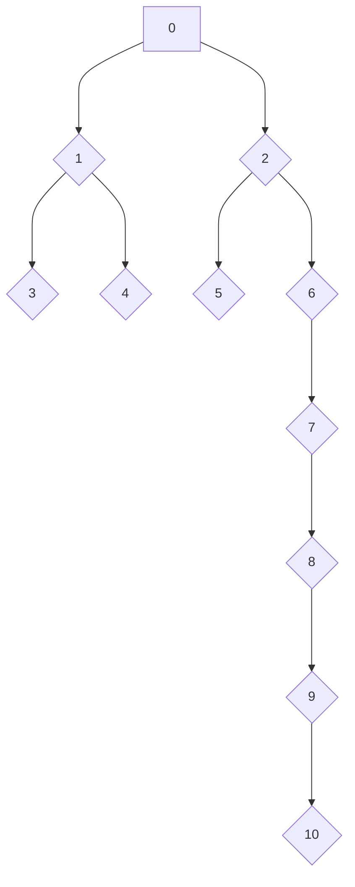

# Tree Traversers

tree-traversers-rs is a library built to provide you with the utilities to easily work with tree data structures in Rust. It provides a default implementation for the majority use case (Vec-based heap-allocated lists of children) - see the TreeNode struct, but this crate is written such that you can build your own implementations as well using other collection types.

### Benefits

The largest benefit of using this library is that the various tree traversers are interchangeable in the for loop syntax. This means I can write my code to use a breadth-first-search today and trivially swap it out for a depth-first pre or postorder search tomorrow without significantly changing the structure of my code.

The other benefit of this library is its tight integration with the rest of Rust's iterators. Because each API returns an iterator, you can proceed to use the iterator APIs like filter, map, and reduce.

## Getting Started

The easiest way to get started is to simply add this crate as a dependency and add a using statement to pull in its prelude (tree_iterators_rs::prelude). You can then create your data structure using the TreeNode struct provided and build on top of it. This struct provides the default implementation of all functionality in this crate. The methods that come attached to this struct include the following (all of which can be found in [this file](https://github.com/mr-adult/tree-iterators-rs/blob/main/src/prelude.rs file):
- Owned Iterator APIs - these take ownership of the TreeNode similar to an into_iter() call.
	- bfs()
	- dfs_preorder()
	- dfs_postorder()
- Mutable borrow APIs - these do not take ownership and behave similar to an iter_mut() call.
	- bfs_iter_mut()
	- dfs_preorder_iter_mut()
	- dfs_postorder_iter_mut()
- Borrow APIs - these do not take ownership and behave similarly to an iter() call.
	- bfs_iter()
	- dfs_preorder_iter()
	- dfs_postorder_iter()


## Examples

For all of the following examples, we will use the tree structure as follows. It is complicated enough to convey the tree iterators' behavior thoroughly without being overwhelming.



### Breadth-First-Search (BFS)

All 3 APIs' usage are identical other than their borrowing model, so only one example will be given.
```rust
// Tree creation (see above documentation)
let root = create_example_tree();

let mut result = String::new();
for value in root.bfs() {
	result.push_str(&value.to_string());
	result.push_str(", ");
}

// result: 0, 1, 2, 3, 4, 5, 6, 7, 8, 9, 10,
println!("{}", result);
```

This code could also be written using Rust's iterator APIs:
```rust
// Tree creation (see above documentation)
let root = create_example_tree();

let result = 
	root.bfs()
		.map(|val| val.to_string())
		.collect::<Vec<String>>()
		.join(", ");

// result: 0, 1, 2, 3, 4, 5, 6, 7, 8, 9, 10,
println!("{}", result);
```

An equivalent set of code not using this crate would look like this:
```rust
// Tree creation (see above documentation)
let root = create_example_tree();

let mut result = String::new();

let mut queue = VecDeque::new();
queue.push_back(root);
while queue.len() > 0 {
	if let Some(front) = queue.pop_front() {
		if let Some(children) = front.children {
			for child in children {
				queue.push_back(child);
			}
		}

		result.push_str(&front.value.to_string());
		result.push_str(", ");
	}
}

// result: 0, 1, 2, 3, 4, 5, 6, 7, 8, 9, 10,
println!("{}", result);
```

### Depth-First Preorder Search (DFS Preorder)

Similarly to the BFS example, all 3 APIs' usage are identical other than their borrowing model, so only one example will be given.

```rust
// Tree creation (see above documentation)
let root = create_example_tree();

let mut result = String::new();
for value in root.dfs_preorder() {
	result.push_str(&value.to_string());
	result.push_str(", ");
}

// result: 0, 1, 3, 4, 2, 5, 6, 7, 8, 9, 10,
println!("{}", result);
```

This code could also be written using Rust's iterator APIs:
```rust
// Tree creation (see above documentation)
let root = create_example_tree();

let result = 
	root.dfs_preorder()
		.map(|val| val.to_string())
		.collect::<Vec<String>>()
		.join(", ");

// result: 0, 1, 3, 4, 2, 5, 6, 7, 8, 9, 10,
println!("{}", result);
```

An equivalent set of code not using this crate would look like this:
```rust
// Tree creation (see above documentation)
let root = create_example_tree();

let mut result = String::new();

let mut stack = vec![root];
while stack.len() > 0 {
	if let Some(top) = stack.pop() {
		if let Some(mut children) = top.children {
			children.reverse();
			for child in children {
				stack.push(child);
			}
		}

		result.push_str(&top.value.to_string());
		result.push_str(", ");
	}
}

// result: 0, 1, 3, 4, 2, 5, 6, 7, 8, 9, 10,
println!("{}", result);
```

## Depth First Postorder Search (DFS Postorder)

Similarly to the BFS and DFS preorder examples, all 3 APIs' usage are identical other than their borrowing model, so only one example will be given.
```rust
// Tree creation (see above documentation)
let root = create_example_tree();

let mut result = String::new();
for value in root.dfs_postorder() {
	result.push_str(&value.to_string());
	result.push_str(", ");
}

// result: 3, 4, 1, 5, 10, 9, 8, 7, 6, 2, 0,
println!("{}", result);
```
This code could also be written using Rust's iterator APIs:
```rust
// Tree creation (see above documentation)
let root = create_example_tree();

let result = 
	root.dfs_postorder()
		.map(|val| val.to_string())
		.collect::<Vec<String>>()
		.join(", ");

// result: 3, 4, 1, 5, 10, 9, 8, 7, 6, 2, 0,
println!("{}", result);
```

An equivalent set of code not using this crate would look like the following. It is important to note that the dfs_postorder API does not use recursion and thus does not incur the overhead of stack frames that this example does. For purposes of simplicity in the example, recursion was chosen. Rust's ownership model is difficult to work around with this traversal type and would make the example more complex than necessary.
```rust
fn dfs_postorder(node: TreeNode<usize>, result: &mut String) {
	if let Some(children) = node.children {
		for child in children {
			dfs_postorder(child, result);
		}
	}

	result.push_str(", ");
	result.push_str(&node.value.to_string());
}

// Tree creation (see above documentation)
let root = create_example_tree();

let mut result = String::new();
dfs_postorder(root, &mut result);

// result: 3, 4, 1, 5, 10, 9, 8, 7, 6, 2, 0,
println!("{}", result);
```

## Custom Tree Node Implementations

This crates' APIs are powered by 3 traits. The traits include:
1. OwnedTreeNode - this trait powers the bfs(), dfs_preorder(), and dfs_postorder() APIs.
2. MutBorrowedTreeNode - this trait powers the bfs_iter_mut(), dfs_preorder_iter_mut() and dfs_postorder() APIs.
3. BorrowedTreeNode - this trait powers the bfs_iter(), dfs_preorder_iter(), and dfs_postorder_iter() APIs.

You may pick and choose which of the traits you implement to suit your needs. They are identical apart from some naming conventions and the ownership of the value returned from their required method implementation.

### Example

As an example, we can implement another TreeNode variant that uses a Linked List to hold its children. All code here is MIT licensed and you are free to directly copy or modify it as you see fit subject to the conditions of the license.
```rust
use crate::prelude::*;
use std::collections::LinkedList;

struct LLTreeNode<T> {
    value: T,
    children: LinkedList<LLTreeNode<T>>
}
```

This is a good start, but realistically we want it to implement all of the tree traversal APIs available to us. 

#### Owned implementation

We can start with the OwnedTreeNode implementation as follows. Since we chose to use a LinkedList as our children property, we have to wrap its iterator in a Some() Option variant. The hardest part of implementing this is figuring out the type of LinkedList's into_iter() method return type.
```rust
use std::collections::linked_list::IntoIter;

impl<T> OwnedTreeNode for LLTreeNode<T> {
    type OwnedValue = T;
    type OwnedChildren = IntoIter<LLTreeNode<T>>;

    fn get_value_and_children(self) -> (Self::OwnedValue, Option<Self::OwnedChildren>) {
        (
            self.value,
            Some(self.children.into_iter())
        )
    }
}
```
Now that we have implemented OwnedTreeNode, our type has the bfs(), dfs_preorder(), and dfs_postorder() methods.

#### Mutable Borrow Implementation

The mutable borrow implementation is very similar to the owned one. The only difference is that the 'Value' associated type changed to a mutable reference and we are calling iter_mut() instead of into_iter().
```rust
use std::collections::linked_list::IterMut;

impl<'a, T> MutBorrowedTreeNode<'a> for LLTreeNode<T> 
    where Self: 'a {

    type MutBorrowedValue = &'a mut T;
    type MutBorrowedChildren = IterMut<'a, LLTreeNode<T>>;

    fn get_value_and_children_iter_mut(&'a mut self) -> (Self::MutBorrowedValue, Option<Self::MutBorrowedChildren>) {
        (
            &mut self.value,
            Some(self.children.iter_mut())
        )
    }
}
```
Now that we have implemented MutBorrowedTreeNode, our type has the bfs_iter_mut(), dfs_preorder_iter_mut(), and dfs_postorder_iter_mut() methods.

#### Borrow Implementation

The borrow implementation is also very similar to the owned one. The only difference is that the 'Value' associated type changed to an immutable reference and we are calling iter() instead of into_iter().
```rust
use std::collections::linked_list::Iter;

impl<'a, T> BorrowedTreeNode<'a> for LLTreeNode<T> 
    where Self: 'a {

    type BorrowedValue = &'a T;
    type BorrowedChildren = Iter<'a, LLTreeNode<T>>;

    fn get_value_and_children_iter(&'a self) -> (Self::BorrowedValue, Option<Self::BorrowedChildren>) {
        (
            &self.value,
            Some(self.children.iter())
        )
    }
}
```
Now that we have implemented MutBorrowedTreeNode, our type has the bfs_iter(), dfs_preorder_iter(), and dfs_postorder_iter() methods.